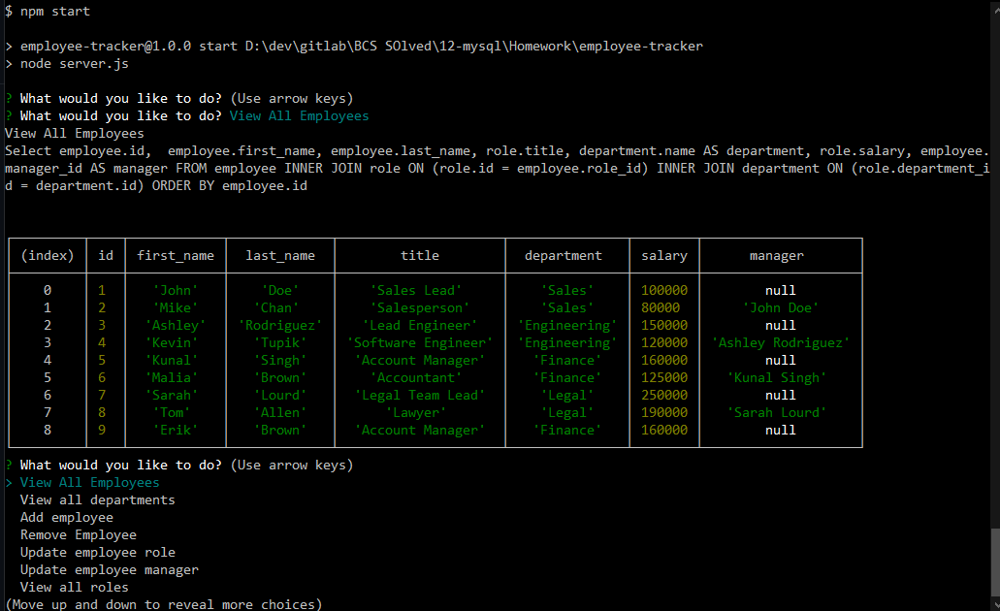

# Employee-Tracker

## Description 

This application allows a user to connect to their mysql employee database and view, add, remove, and update information related to their company structure and their employees.

## Table of Contents

* [Install](#install)
* [Usage](#usage)
* [License](#license)
* [Questions](#questions)

## Install

If you do not have the database setup you will need to have MySQL installed and setup
Once you have that copy the content of the two files int he db folder into the MySQL workshop and run them

To install this app:
* download all the files from this github repository
* in your terminal navigate to the directory you downloaded the files using the cd command 
* ex: ``cd d/dev/eomployee-tracker``
* once in the directory type the command ``npm i``
* Finally go to the connection.js file and where is says password: '', put your mysql password in the single quotes

Once the final step is completed the application is ready to be launched

## Usage 

To start this application type the command ``npm start``

You will be asked to choose one of several actions in regards to your database

Here is an example image of the app in action:

# License

This project is covered by the [MIT](https://opensource.org/licenses/MIT) License

# Questions

Here is a link to my [Github](https://github.com/ejbrownlf)

You can reach me by emailing me here at ejbrownlf@gmail.com

